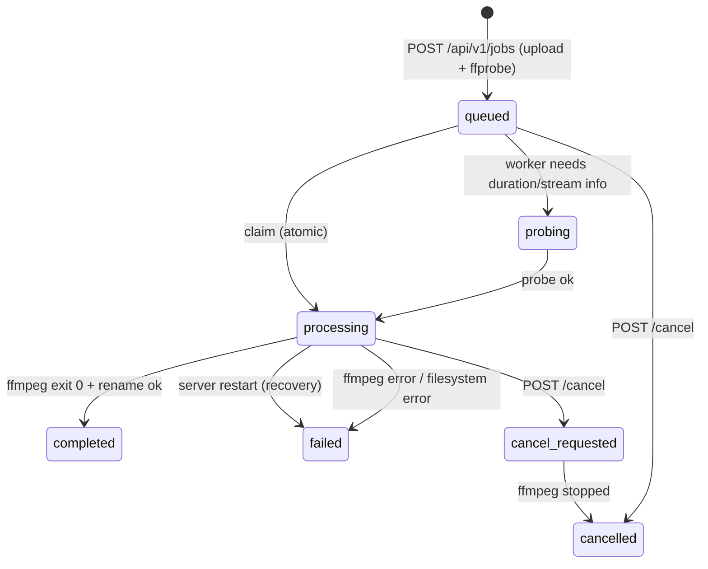

# video-upscaler-api

Backend API that automates video upscaling on Windows with the custom **Topaz Video AI
FFmpeg/FFprobe** binaries. Upload a video over HTTP, the server queues it, renders it one job
at a time on the GPU, and exposes real-time progress — the browser is only an observer and can be
closed at any time.

```
POST /api/v1/jobs  ──►  TEMP_DIR/<jobId>/input.mp4  ──►  SQLite queue  ──►  worker (1 at a time)
                                                                                  │
        D:\Hasil Render\name_prob3_3840x1620.mp4  ◄── atomic rename ◄── .<jobId>.rendering.mp4
```

### Documentation

| Document | Audience |
| --- | --- |
| [`docs/API.md`](docs/API.md) | **Frontend team** — complete endpoint reference, error codes, TypeScript types, upload/polling/cancel/download recipes |
| [`docs/openapi.json`](docs/openapi.json) | Tooling — OpenAPI 3.1 spec (Postman/Insomnia import, client generation); kept in sync by `test/unit/openapi.test.js` |
| This README | Operators — installation, configuration, PM2, troubleshooting |

---

## Table of contents

1. [Requirements](#1-requirements)
2. [Installation](#2-installation)
3. [Configuration](#3-configuration)
4. [Running](#4-running)
5. [PM2 (production)](#5-pm2-production)
6. [API](#6-api)
7. [Job lifecycle](#7-job-lifecycle)
8. [Architecture](#8-architecture)
9. [Tests](#9-tests)
10. [Behaviour notes and limitations](#10-behaviour-notes-and-limitations)
11. [Troubleshooting](#11-troubleshooting)

---

## 1. Requirements

| Requirement | Notes |
| --- | --- |
| Windows 10/11 or Windows Server | The whole process/termination/rename logic is Windows aware. |
| Node.js **>= 22.5** (tested on 24/26) | Uses the built-in `node:sqlite` module — no native build step. |
| NVIDIA GPU + current driver | Rendering uses `h264_nvenc`; the Topaz models need a CUDA-capable device. |
| Topaz Video AI installed | Provides the ffmpeg/ffprobe builds with the `tvai_up` filter and the model files. |
| Disk space | `TEMP_DIR` needs room for the uploaded file, `OUTPUT_DIR` for the render. |

Default binaries (never the system `ffmpeg`):

```text
C:\Program Files\Topaz Labs LLC\Topaz Video AI\ffmpeg.exe
C:\Program Files\Topaz Labs LLC\Topaz Video AI\ffprobe.exe
```

The models the renderer needs are downloaded the first time Topaz Video AI runs. If a model is
missing, ffmpeg fails with `Model not found: prob-3`; the API surfaces that as
`Topaz model is not available ... Open Topaz Video AI once to download the model`.

---

## 2. Installation

```bat
cd D:\path\to\video-upscaler-api
npm install
copy .env.example .env
notepad .env
```

`.env` is optional: everything has a default that matches the paths above, so the service also
starts without it on the render machine.

---

## 3. Configuration

Everything is read once at startup from `.env` / the process environment (`src/config/env.js`).

### Paths and binaries

| Variable | Default | Description |
| --- | --- | --- |
| `PORT` | `3000` | HTTP port. |
| `HOST` | `0.0.0.0` | Bind address. |
| `TEMP_DIR` | `D:\VideoTemp` | Uploaded inputs, one folder per job. |
| `OUTPUT_DIR` | `D:\Hasil Render` | Finished renders (and their temp files). |
| `DATA_DIR` | `./data` | SQLite database (`jobs.sqlite`). |
| `LOGS_DIR` | `./logs` | Log files when `LOG_TO_FILE=true`. |
| `DB_FILE` | `<DATA_DIR>\jobs.sqlite` | Override the database file. |
| `FFMPEG_PATH` | `C:\Program Files\Topaz Labs LLC\Topaz Video AI\ffmpeg.exe` | Must contain `tvai_up`. |
| `FFPROBE_PATH` | `C:\Program Files\Topaz Labs LLC\Topaz Video AI\ffprobe.exe` | |

### Upload and validation

| Variable | Default | Description |
| --- | --- | --- |
| `MAX_UPLOAD_SIZE_BYTES` | `53687091200` (50 GiB) | Uploads above this are rejected with `413`. |
| `MIN_DIMENSION` / `MAX_DIMENSION` | `16` / `7680` | Accepted `width`/`height` range. |
| `ENFORCE_EVEN_DIMENSIONS` | `true` | H.264 `yuv420p` needs even dimensions. |
| `ALLOWED_VIDEO_EXTENSIONS` | `mp4,mkv,mov,webm,m4v,avi,mpg,mpeg,ts,m2ts` | Extension allowlist (the real check is ffprobe). |
| `PROBE_TIMEOUT_MS` | `60000` | ffprobe timeout per file. |

### Queue and rendering

| Variable | Default | Description |
| --- | --- | --- |
| `QUEUE_CONCURRENCY` | `1` | **Forced to 1** (one GPU renderer); a different value is ignored with a warning. |
| `TOPAZ_MODEL` | `prob-3` | Default model used by `tvai_up`. |
| `ALLOWED_MODELS` | `prob-3,prob-4` | Models a job may select (the default model is always included). |
| `ALLOW_RENDER_TUNING` | `true` | `false` → `POST /api/v1/jobs` accepts only `video`/`width`/`height` (strict baseline). |
| `MAX_GPU_INDEX` | `0` | Highest GPU index accepted for the per-job `device` option. |
| `AUDIO_MODE` | `auto` | Default audio handling: `auto` = stream copy when the codec is mp4-safe, otherwise re-encode to AAC. `copy` / `reencode` force one. Per-job override: `audio`. |
| `PROGRESS_PERSIST_INTERVAL_MS` | `500` | Throttle for SQLite progress writes. |
| `RECONCILE_INTERVAL_MS` | `30000` | How often the queue re-syncs with `status = 'queued'`. |
| `FFMPEG_STDERR_TAIL_BYTES` | `16384` | Bounded ffmpeg stderr kept in memory for diagnostics. |
| `MAX_STDERR_SUMMARY_LENGTH` | `1000` | Length of the error message stored on a failed job. |

### Retention and cleanup

| Variable | Default | Description |
| --- | --- | --- |
| `JOB_RETENTION_HOURS` | `72` | Completed/cancelled job records older than this are purged. |
| `FAILED_JOB_RETENTION_HOURS` | `24` | Same for failed jobs (their uploaded input is kept until then). |
| `TEMP_STALE_HOURS` | `24` | Stale temp folders / orphan `.rendering.mp4` files are removed. |
| `CLEANUP_INTERVAL_MS` | `1800000` | Periodic cleanup interval (30 min). |

Rendered files in `OUTPUT_DIR` are **never** deleted by cleanup.

### Startup validation

| Variable | Default | Description |
| --- | --- | --- |
| `RENDERER_SELFTEST` | `true` | Encode one frame with `h264_nvenc` to verify the GPU/driver actually works. |
| `RENDERER_MODEL_SELFTEST` | `true` | Try to load `TOPAZ_MODEL` once, so a missing model is reported at startup. |
| `REQUIRE_NVENC` | `true` | Fail startup when `h264_nvenc` is missing from the build. |
| `ALLOW_DEGRADED_START` | `false` | Start even if `ffmpeg`, `ffprobe` or `tvai_up` validation fails. |
| `SINGLE_INSTANCE` | `true` | Refuse to start while another instance holds the GPU. |
| `RENDERER_PROCESS_NAME` | `ffmpeg` | Process name checked before a leftover pid is force-killed. |
| `HTTP_REQUEST_TIMEOUT_MS` | `0` | `0` = no limit (multi-hour uploads must not be cut off). |

### Lifecycle, HTTP and logging

| Variable | Default | Description |
| --- | --- | --- |
| `SHUTDOWN_POLICY` | `terminate` | `terminate` kills the active render, `wait` lets it finish first. |
| `SHUTDOWN_TIMEOUT_MS` | `15000` | Budget for the graceful shutdown. |
| `KILL_GRACE_MS` | `5000` | Grace period before `taskkill /T /F` on cancellation. |
| `CORS_ORIGIN` | `*` | `*` or a comma separated allowlist. |
| `JSON_BODY_LIMIT` | `100kb` | Limit for JSON endpoints. |
| `LOG_LEVEL` | `info` | `error`, `warn`, `info`, `debug`. |
| `LOG_TO_FILE` | `true` in production | Also write `logs/app-<date>.log`. |

---

## 4. Running

```bat
:: development
npm run dev

:: production (bare node)
npm start
```

On startup the service:

1. creates `TEMP_DIR`, `OUTPUT_DIR`, `DATA_DIR`, `LOGS_DIR` if needed,
2. opens SQLite and applies migrations,
3. validates the Topaz renderer (`ffmpeg`, `ffprobe`, `tvai_up`, `h264_nvenc`, GPU self test),
4. recovers interrupted jobs: `processing`/`probing` → `failed` (*"Renderer interrupted by server
   restart"*), `cancel_requested` → `cancelled`, and every `queued` job is pushed back into the
   execution queue in creation order,
5. starts listening on `PORT`.

## 5. PM2 (production)

```bat
npm install -g pm2
pm2 start ecosystem.config.js
pm2 save
pm2 logs video-upscaler-api
```

`ecosystem.config.js` uses `exec_mode: "fork"` with `instances: 1` on purpose: one Node process
owns the queue, the SQLite file and the single GPU renderer. PM2 cluster mode would run two
renders at once.

To survive a reboot, register PM2 as a Windows service (run PowerShell as Administrator):

```powershell
npm install -g pm2-windows-service
pm2-service-install -n PM2
pm2 start ecosystem.config.js
pm2 save
```

Alternatives: `pm2-windows-startup`, `pm2-installer`, or a scheduled task that runs
`pm2 resurrect` at logon. Verify with `pm2 status` after a reboot.

> **Windows note.** PM2 stops a process with `taskkill`, which cannot deliver a catchable signal.
> The graceful `SIGINT`/`SIGTERM` handler (`Ctrl+C` in a console) stops the renderer, persists
> status and closes SQLite; after a hard kill the recovery pass does the same job on the next
> start, including terminating an ffmpeg process that survived (verified against its process
> name first).

---

## 6. API

> The complete frontend-facing contract lives in [`docs/API.md`](docs/API.md) (field tables, error
> reference, TypeScript types, polling/cancel/upload recipes). The summary below is for operators.

Base URL: `http://<host>:<port>`. Errors are always:

```json
{ "error": { "code": "INVALID_VIDEO", "message": "Uploaded file could not be read as a video." } }
```

| Method | Path | Purpose |
| --- | --- | --- |
| `POST` | `/api/v1/jobs` | Multipart upload (`video`, `width`, `height`) → `202` |
| `GET` | `/api/v1/jobs?page=1&limit=20&status=queued` | Paginated list |
| `GET` | `/api/v1/jobs/:id` | Full job detail |
| `GET` | `/api/v1/jobs/:id/progress` | Lightweight polling endpoint |
| `GET` | `/api/v1/jobs/:id/download` | Streams the finished render |
| `POST` | `/api/v1/jobs/:id/cancel` | Cancel queued or active job |
| `DELETE` | `/api/v1/jobs/:id?deleteOutput=true` | Remove a finished job (row, temp data) |
| `GET` | `/health` | Liveness |
| `GET` | `/api/v1/system/status` | Renderer + queue status |

### Render options

`POST /api/v1/jobs` accepts an optional, **whitelisted** set of tuning fields next to `video`,
`width` and `height` — never free-form ffmpeg arguments or filter strings (AGENTS.md §11/§12):

| Group | Fields | Per-job override of |
| --- | --- | --- |
| Model | `model` | Topaz `tvai_up` model (allowlist via `ALLOWED_MODELS`). |
| Topaz tunables | `preblur`, `noise`, `details`, `halo`, `blur`, `compression`, `blend` | `tvai_up` parameters, each with a bounded range. |
| Performance | `device`, `vram`, `instances` | GPU index, low-VRAM mode, model instances. |
| Encoder | `qp` (1–51), `preset` (p1–p7) | `h264_nvenc` quality knobs. |
| Audio | `audio` (`auto`/`copy`/`aac`/`reencode`/`none`) | Stream copy, AAC re-encode or dropping the track. |
| Frame rate | `fps` (1–240, decimals allowed) | Output frame rate via the `fps` filter (frame duplication/dropping — not AI interpolation). Omitted = keep the source rate. |
| Output name | `filename`, `label` | Client-chosen output name: `filename=sosul eater rev` + 3840×1620 → `sosul eater rev 4K.mp4`. `label` defaults to the resolution class (4K / 1440p / 1080p / 720p / WxH) and can be overridden. |

Every field defaults to the frozen baseline, so a request without options produces exactly the
documented command. Values are validated before the job is created, stored per job (so a recovered
job re-renders with the same settings) and echoed in the response as `render`. `ALLOW_RENDER_TUNING=false`
restores the strict “width/height only” behaviour for the whole server.

Without a custom `filename` the output keeps the automatic naming scheme
(`source_prob3_3840x1620.mp4`); with one it becomes `sosul eater rev 4K.mp4`. Either way an existing
file is never overwritten — a collision adds a `_<jobId8>-n` suffix.

> Full field reference for the frontend: [`docs/API.md` → *Render options*](docs/API.md#render-options-optional).
> The live ranges and allowed values are exposed by `GET /api/v1/system/status` → `renderOptions`, so
> the UI can build the form at runtime.

### Upload a video

Only `video`, `width` and `height` are required; the optional [render options](#render-options-optional)
let a client pick the model, Topaz tunables, encoder quality and audio handling — per request.

Windows `cmd.exe` (note `curl.exe`, because PowerShell aliases `curl`):

```bat
curl.exe -X POST http://localhost:3000/api/v1/jobs ^
  -F "video=@D:\videos\sosul eater rev.mp4" ^
  -F "width=3840" ^
  -F "height=1620"
```

PowerShell:

```powershell
curl.exe -X POST http://localhost:3000/api/v1/jobs `
  -F 'video=@D:\videos\sosul eater rev.mp4' `
  -F 'width=3840' `
  -F 'height=1620'
```

```json
{
  "id": "769337925-2f4c-4c4c-9a1c-2f4c4c9a1c37",
  "status": "queued",
  "position": 2,
  "width": 3840,
  "height": 1620
}
```

The response is sent as soon as the file is on disk and the job exists — never after rendering.
`position` is 1-based inside the render pipeline (1 = rendering or next), so it may change while
you poll.

### Poll progress (~1×/second)

```bat
curl.exe http://localhost:3000/api/v1/jobs/<id>/progress
```

```json
{
  "id": "769337925-…",
  "status": "processing",
  "progress": 47.85,
  "frame": 12842,
  "fps": 31.4,
  "speed": "0.82x",
  "elapsed": 513,
  "duration": 1072,
  "output": null
}
```

Completed:

```json
{
  "id": "769337925-…",
  "status": "completed",
  "progress": 100,
  "output": { "filename": "sosul eater rev_prob3_3840x1620.mp4", "sizeBytes": 1892344331 },
  "completed": true
}
```

Polling only reads in-memory state plus SQLite — it never starts ffmpeg/ffprobe and never scans the
filesystem, so it is cheap enough for a 1 Hz frontend timer. Closing the browser does not affect
the render; reopen it and `GET /api/v1/jobs` shows every job with its current state.

### Download

```bat
curl.exe -o "D:\downloads\upscaled.mp4" http://localhost:3000/api/v1/jobs/<id>/download
```

Streams the file (no buffering), supports range requests, and returns `409 JOB_NOT_COMPLETED`
while the job is still running, `500 OUTPUT_FILE_MISSING` if the file disappeared.

### Cancel

```bat
curl.exe -X POST http://localhost:3000/api/v1/jobs/<id>/cancel
```

* `queued`/`probing` → `cancelled` immediately (removed from the queue, upload deleted).
* `processing` → `cancel_requested` → ffmpeg terminated (process tree, `taskkill /T /F`) → `cancelled`,
  temp output deleted.
* Already finished/cancelled → `409 JOB_NOT_CANCELLABLE` / `409 JOB_ALREADY_COMPLETED`.

### System status

```bat
curl.exe http://localhost:3000/api/v1/system/status
```

```json
{
  "status": "ok",
  "renderer": {
    "available": true,
    "status": "busy",
    "ffmpeg": true,
    "ffprobe": true,
    "tvaiUp": true,
    "h264Nvenc": true,
    "nvencSelftest": true,
    "model": "prob-3",
    "modelSelftest": true,
    "activeJobId": "769337925-…"
  },
  "queue": { "concurrency": 1, "queued": 3, "processing": true, "activeCount": 1, "paused": false },
  "jobs": { "counts": { "queued": 3, "processing": 1, "completed": 12, "failed": 1 } }
}
```

`renderer.status` is `available`, `busy` (a job is rendering) or `unavailable` (validation or
runtime failure; while unavailable the queue pauses and new uploads are rejected with `503`
`RENDERER_UNAVAILABLE`).

---

## 7. Job lifecycle



Only one job can be `processing` at a time; the transition `queued → processing` is a single
conditional `UPDATE`, so a job can never be picked up twice.

---

## 8. Architecture

```text
src/
├── app.js                     express app factory (helmet, cors, routes, error handler)
├── server.js                  entry point: startup -> listen -> graceful shutdown
├── container.js               composition root (single wiring point for every singleton)
├── startup.js                 directory/DB/renderer validation, recovery, single-instance lock
├── config/
│   ├── env.js                 all environment parsing + defaults
│   └── paths.js               runtime paths, job path builders, redaction
├── domain/
│   ├── job-status.js          allowed statuses and transitions
│   └── job-serializer.js      API payload shapes
├── database/
│   ├── database.js            node:sqlite wrapper (WAL, busy timeout, retry, transactions)
│   ├── migrations.js          versioned schema
│   └── repositories/job.repository.js
├── services/
│   ├── upload.service.js      Busboy streaming upload -> TEMP_DIR/<jobId>/input.<ext>
│   ├── probe.service.js       Topaz ffprobe (validation + duration)
│   ├── job.service.js         lifecycle: create/list/cancel/delete/recovery
│   ├── render.service.js      active render registry + cancellation
│   ├── renderer.service.js    renderer availability (ready/degraded/unavailable)
│   └── cleanup.service.js     temp sweeps, retention, orphan files
├── queue/render.queue.js      FIFO execution queue, concurrency 1, reconcile from SQLite
├── workers/render.worker.js   claim -> ffmpeg -> progress -> rename -> next
├── routes/ + controllers/     HTTP layer
├── middleware/                request id, access log, error handler
└── utils/                     ffmpeg args, progress parser, process/terminate, filenames, errors

docs/
├── API.md                     frontend contract (authoritative for API consumers)
└── openapi.json               OpenAPI 3.1 spec for tooling

scripts/
└── smoke.js                   real-binary end-to-end check (npm run smoke)
```

Principles:

* HTTP never touches ffmpeg; the worker never touches the response.
* SQLite is the source of truth for job state, the queue is only the execution mechanism.
* Uploads are streamed (`pipe` + backpressure), never buffered in memory.
* Renders go to `OUTPUT_DIR\.<jobId>.rendering.mp4` and are **renamed** to their final name only
  after ffmpeg exits `0`, so a partially written file can never look finished.
* Inputs are validated with the Topaz `ffprobe` before a job is queued.
* Width/height are validated and injected with an explicit argument builder — never with string
  replacement and never through a shell.

### FFmpeg command

Built by `src/utils/ffmpeg.js` (baseline unchanged, only `w`/`h` are dynamic):

```text
ffmpeg -hide_banner -nostdin -progress pipe:1 -nostats -y -i <input>
  -sws_flags spline+accurate_rnd+full_chroma_int
  -color_trc 1 -colorspace 1 -color_primaries 1
  -filter_complex "tvai_up=model=prob-3:scale=0:w=<W>:h=<H>:preblur=-0.100659:noise=0.25:details=0.75:halo=0.05:blur=0.25:compression=0.2:blend=0.6:device=0:vram=1:instances=1,scale=w=<W>:h=<H>:flags=lanczos:threads=0,scale=out_color_matrix=bt709"
  -c:v h264_nvenc -profile:v high -pix_fmt yuv420p -preset p7 -tune hq -rc constqp -qp 25
  -rc-lookahead 20 -spatial_aq 1 -temporal_aq 1 -aq-strength 15 -b:v 0
  [-map 0:a -c:a copy -bsf:a:0 aac_adtstoasc]
  -map_metadata 0
  -movflags frag_keyframe+empty_moov+delay_moov+use_metadata_tags+write_colr
  <output>
```

The three bracketed audio arguments are applied **conditionally** because the raw baseline command
fails on real inputs: `-map 0:a` makes ffmpeg abort on a silent video (verified: *"Error parsing
options for output file ... Invalid argument"*), and `-bsf:a:0 aac_adtstoasc` makes it abort on
non-AAC audio (verified: AC-3 → exit `-22`). So:

* no audio stream → no audio arguments;
* AAC audio → the baseline verbatim (`-map 0:a -c:a copy -bsf:a:0 aac_adtstoasc`);
* other codecs → `-c:a copy` (or `-c:a aac -b:a 192k` when the codec cannot be muxed into mp4);
* `audio=none` → `-an` (the track is dropped).

Per-job render options only ever change `model`, the `tvai_up` tunables, `device`/`vram`/`instances`,
`-qp`/`-preset` and the audio mapping above — the structure of the command is fixed, and `w`/`h`
always come from the request.

---

## 9. Tests

```bat
npm test                 :: everything (81 tests)
npm run test:unit        :: parser, argument builder, filenames, queue, repository, cleanup, lock
npm run test:integration :: HTTP contract, streaming upload, worker lifecycle, restart recovery
```

The suite runs without a GPU: the Topaz binaries are replaced by `test/helpers/fixtures/fake-ffmpeg.cjs`
and `fake-ffprobe.cjs`, which emit real `-progress pipe:1` blocks, fail on demand
(`FAKE_FFMPEG_MODE=fail|fail-model|no-output|hang`) and write real output files.

On the render machine, verify the real chain (real Topaz ffmpeg, real GPU, real model) with:

```bat
npm start
:: in another terminal
npm run smoke
```

`npm run smoke` generates a small clip, uploads it, polls progress, downloads the result and exits
non-zero if no render was produced.

Covered: job creation, dimension validation, streaming upload + memory bound, size limit (both the
`Content-Length` pre-check and the in-flight guard), invalid/audio-only files, queue ordering,
concurrency = 1, duplicate protection, status transitions, progress parsing (including a burst of
blocks in one chunk), success/failure/no-output renders, cancellation of queued *and* active jobs
including the immediate-cancel race, cleanup and retention, restart recovery, orphan-pid
termination vs. pid reuse, path traversal, and the single-instance lock.

Documentation drift is tested too: `test/unit/openapi.test.js` fails if a route, error code or
serializer field is not documented in `docs/openapi.json`, and the integration suite compares real
HTTP responses against the documented schemas.

---

## 10. Behaviour notes and limitations

* **One renderer.** `QUEUE_CONCURRENCY` is clamped to `1`; two jobs never use the GPU at once. A
  second instance of the service is refused while the first holds the lock file
  (`DATA_DIR\video-upscaler.lock`).
* **Render options are per job and immutable afterwards.** They are stored with the job
  (`render_options` column, JSON) and re-used if the job is re-queued after a restart; changing them
  means uploading again.
* **Output container is always MP4** (`h264_nvenc` + mp4 muxer flags), so a `.mkv` input still
  produces `name_prob3_WxH.mp4` — or the client-provided `<filename> <label>.mp4`.
* **`fps` converts the frame rate by duplication/dropping.** AI frame interpolation (Topaz `tvai_fi`)
  is not part of this option.
* **Existing renders are never overwritten**: if the name is taken, a `_<jobId>-<n>` suffix is added.
* **Deleting a job does not delete the render** unless you pass `?deleteOutput=true`.
* **Failed jobs keep their uploaded input** for `FAILED_JOB_RETENTION_HOURS` (diagnostics); completed
  and cancelled jobs delete `TEMP_DIR\<jobId>` immediately.
* **Unknown duration**: if the container exposes neither `format.duration`, stream duration nor
  `nb_frames`, `progress` stays `0` until the render finishes (`progress=100`).
* **Progress is throttled** to one SQLite write per `PROGRESS_PERSIST_INTERVAL_MS`; the polling
  endpoint returns the fresher in-memory value.
* **Paths are never returned** to clients: the API exposes filenames only, and configured runtime
  directories are redacted (`<temp>`, `<output>`) from error messages.

---

## 11. Troubleshooting

| Symptom | Cause / fix |
| --- | --- |
| Startup: `Renderer validation failed: tvai_up filter was not found in: …` | `FFMPEG_PATH` points at a normal ffmpeg build. Point it at the Topaz Video AI binary. |
| Startup: `h264_nvenc was not found` / `Cannot load nvcuda.dll` | No NVIDIA driver (or a remote/headless session without GPU access). Install the driver; the self test then passes. |
| Render fails: `Topaz model is not available: Model not found: prob-3` | Open Topaz Video AI once so it downloads the model, or set `TOPAZ_MODEL` to an installed one. The startup warning (`RENDERER_MODEL_SELFTEST`) reports this before the first upload. |
| Render fails: `NVIDIA encoder is not available: …` | The driver stopped working or the GPU is busy; the renderer is marked unavailable, the queue pauses, and it retries automatically after `RENDERER_RECHECK_COOLDOWN_MS`. |
| `413 UPLOAD_TOO_LARGE` | Raise `MAX_UPLOAD_SIZE_BYTES` (default 50 GiB). |
| `400 … "width" must be an even number` | H.264 yuv420p requires even dimensions; disable with `ENFORCE_EVEN_DIMENSIONS=false` only if your encoder allows it. |
| `409 JOB_ACTIVE` when deleting | Cancel the job first; deletion is refused only while it is `probing`/`processing`/`cancel_requested` (a `queued` job is cancelled and deleted in one step). |
| Jobs stay `queued` forever | The queue is paused (check `queue.paused` in `/api/v1/system/status`), usually because the renderer is unavailable. |
| A job is `failed` with *"Renderer interrupted by server restart"* | Expected after a crash/PM2 restart: interrupted renders are never resumed (they would restart from zero anyway), the uploaded input is kept for `FAILED_JOB_RETENTION_HOURS`. |
| Leftover `.rendering.mp4` files in `D:\Hasil Render\` | Partially written renders from a crash; removed automatically once they are older than `TEMP_STALE_HOURS`. |
| `EACCES` on startup / lock error | Another instance is running (`pm2 status`) or a stale `DATA_DIR\video-upscaler.lock` exists with a live pid. |
| Port already in use | Change `PORT` or stop the other process (`netstat -ano \| findstr :3000`). |

Logs are grep-able per job:

```text
2026-09-14T07:30:00.123Z [INFO] job: Job 769337925-… created (input.mp4, 3840x1620, 1072.50s, audio=aac)
2026-09-14T07:30:01.456Z [INFO] worker: Job 769337925-… ffmpeg PID=12345
2026-09-14T07:30:01.998Z [INFO] worker: Job 769337925-… progress=47.85%
2026-09-14T08:30:12.001Z [INFO] worker: Job 769337925-… completed -> input_prob3_3840x1620.mp4 (1.72 GiB, 3840x1620)
```
