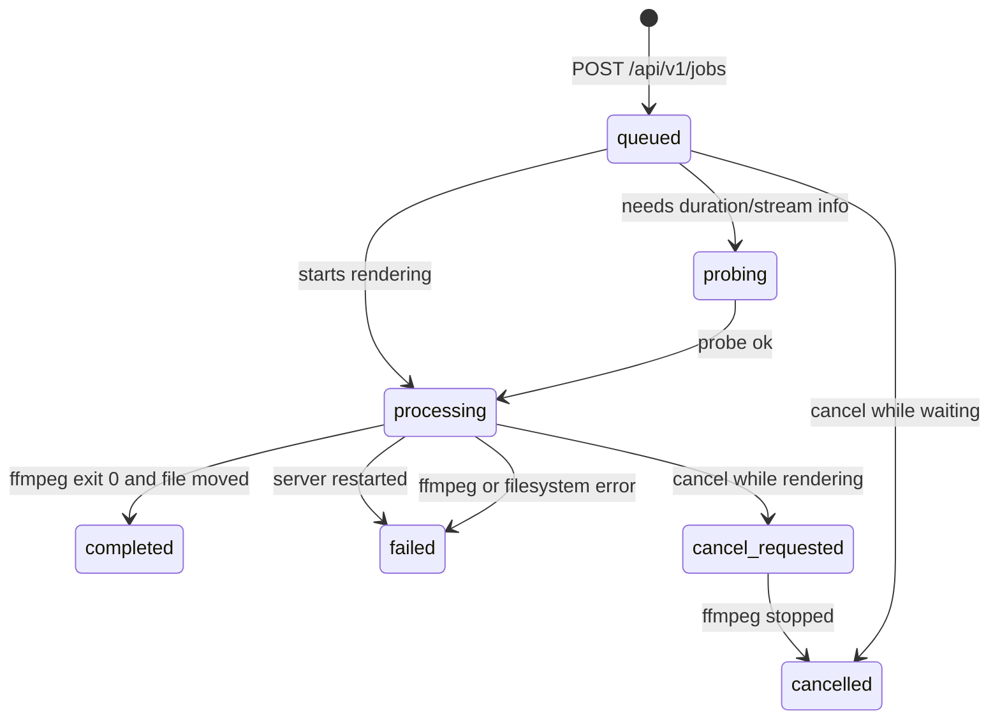

# video-upscaler-api — Frontend API Guide

Everything a frontend needs to upload videos, watch render progress, cancel jobs and download the
upscaled result.

* **Base URL:** `http://<renderer-host>:3000` (configurable with `PORT`)
* **API version:** `v1` — all job endpoints live under `/api/v1`
* **Machine-readable spec:** [`docs/openapi.json`](./openapi.json) (import into Postman/Insomnia or
  generate a typed client)
* **Auth:** none. Put the API behind your own gateway/VPN if it is exposed publicly.

---

## Table of contents

1. [Quick start](#1-quick-start)
2. [Conventions](#2-conventions)
3. [Error reference](#3-error-reference)
4. [Job status reference](#4-job-status-reference)
5. [Endpoints](#5-endpoints)
   * [`POST /api/v1/jobs`](#51-post-apiv1jobs--upload-and-create-a-job) — including [render options](#render-options-optional)
   * [`GET /api/v1/jobs`](#52-get-apiv1jobs--list-jobs)
   * [`GET /api/v1/jobs/{id}`](#53-get-apiv1jobsid--job-detail)
   * [`GET /api/v1/jobs/{id}/progress`](#54-get-apiv1jobsidprogress--poll-progress)
   * [`GET /api/v1/jobs/{id}/download`](#55-get-apiv1jobsiddownload--download-the-result)
   * [`POST /api/v1/jobs/{id}/cancel`](#56-post-apiv1jobsidcancel--cancel-a-job)
   * [`DELETE /api/v1/jobs/{id}`](#57-delete-apiv1jobsid--delete-a-job)
   * [`GET /health`](#58-get-health--liveness)
   * [`GET /api/v1/system/status`](#59-get-apiv1systemstatus--renderer-and-queue-status)
6. [Frontend recipes](#6-frontend-recipes)
   * [TypeScript types](#61-typescript-types)
   * [Upload with progress](#62-upload-with-progress)
   * [Client-side pre-validation](#63-client-side-pre-validation)
   * [Polling loop](#64-polling-loop)
   * [Resuming after a reload](#65-resuming-after-a-reload--browser-was-closed)
   * [Cancel & delete UX](#66-cancel--delete-ux)
   * [Download & preview](#67-download--preview)
   * [Renderer availability banner](#68-renderer-availability-banner)
   * [Mapping codes to user-facing copy](#69-mapping-error-codes-to-user-facing-copy)
   * [Building the render-options form](#610-building-the-render-options-form)
7. [Limits and defaults](#7-limits-and-defaults)
8. [Renderer availability & troubleshooting](#8-renderer-availability--troubleshooting)
9. [Stability & versioning](#9-stability--versioning)

---

## 1. Quick start

```text
1. POST /api/v1/jobs                      (multipart: video + width + height)  -> 202 { id, status, position }
2. GET  /api/v1/jobs/{id}/progress        every ~1 s until status is terminal
3. GET  /api/v1/jobs/{id}/download        when status === "completed"
```

The render happens on the server, not in the browser. Closing the tab, reloading or losing the
network does **not** affect the job — reopen the page and continue polling `GET /api/v1/jobs`.

| Method | Path | Purpose | Success |
| --- | --- | --- | --- |
| `POST` | `/api/v1/jobs` | Upload a video and create a job | `202` |
| `GET` | `/api/v1/jobs` | Paginated job list (dashboard, history) | `200` |
| `GET` | `/api/v1/jobs/{id}` | Full job detail | `200` |
| `GET` | `/api/v1/jobs/{id}/progress` | Lightweight polling payload | `200` |
| `GET` | `/api/v1/jobs/{id}/download` | Stream the rendered MP4 | `200` / `206` |
| `POST` | `/api/v1/jobs/{id}/cancel` | Cancel queued or running job | `200` |
| `DELETE` | `/api/v1/jobs/{id}` | Delete a finished job record | `200` |
| `GET` | `/health` | Liveness probe | `200` |
| `GET` | `/api/v1/system/status` | Renderer + queue status | `200` |

---

## 2. Conventions

### Base URL and versioning

```
http://<host>:<port>/api/v1/...      job + system endpoints
http://<host>:<port>/health          outside the versioned prefix
```

### Headers

| Header | Direction | Notes |
| --- | --- | --- |
| `Content-Type: multipart/form-data; boundary=...` | Request | Required for `POST /api/v1/jobs`. Do **not** set it by hand — let the browser/`FormData` add the boundary. |
| `Content-Type: application/json` | Request | Only for endpoints with a JSON body (none of the current ones). |
| `x-request-id` | Both | Optional on the way in (`[A-Za-z0-9._-]{8,128}`), always echoed back. Log it with client-side errors — it makes server logs traceable. |
| `Content-Disposition` | Response (download) | `attachment; filename="ascii.mp4"; filename*=UTF-8''percent-encoded.mp4` |
| `Accept-Ranges: bytes` | Response (download) | The download endpoint supports range requests. |
| `Connection: close` | Response (`413`) | Only on oversized uploads: the server answers and drops the connection, so do not retry on the same keep-alive connection. |

### CORS

Default `CORS_ORIGIN=*` (any origin, no credentials). If the backend team sets an allowlist, only
those origins get a CORS header. Allowed methods: `GET, POST, DELETE, OPTIONS`; preflight results
are cached for 24 h. Exposed response headers: `Content-Disposition`, `Content-Length`,
`Accept-Ranges`, `x-request-id`.

### Data types

| Type | Rules |
| --- | --- |
| Timestamps | ISO 8601 UTC strings, e.g. `"2026-09-14T07:30:00.123Z"`. `null` when the event has not happened yet. |
| Durations / elapsed | Seconds (float), e.g. `1072.5`. |
| `progress.percent` / `progress` | Float `0…100`, clamped server-side (never above 100). |
| Bytes | Integers (`sizeBytes`). |
| `fps` | Float, e.g. `31.4`. |
| `speed` | String exactly as ffmpeg prints it, e.g. `"0.82x"` — display as-is, do not parse (parse `parseFloat` only if you need a number). |
| IDs | UUID v4 strings, e.g. `"769337925-…"`. Treat them as opaque strings. |
| Filenames | Sanitized basenames. **Server filesystem paths are never returned.** |

Nullable fields are explicit `null`, never omitted — except three convenience keys:

* `progress.error` — present **only** when the job failed.
* `progress.completed` — present **only** for terminal statuses (`true` for `completed`,
  `false` for `failed`/`cancelled`).
* `queuePosition` — present in list items, `null` unless the job is `queued`.

### Error envelope

Every non-2xx response (except an abrupt client abort) has the same body:

```json
{
  "error": {
    "code": "VALIDATION_ERROR",
    "message": "\"width\" must be an even number because the result is encoded as H.264 yuv420p.",
    "details": { "field": "width" }
  }
}
```

* `code` — stable, machine-readable, always one of [the codes below](#3-error-reference). Switch on
  this, never on `message`.
* `message` — human-readable English, safe to display (or map to your own copy).
* `details` — optional object, shape depends on the code (see the table).

---

## 3. Error reference

| `code` | HTTP | Raised when | `details` | Suggested frontend behaviour |
| --- | --- | --- | --- | --- |
| `VALIDATION_ERROR` | 400 | Missing/invalid `width`/`height`, bad file format, bad pagination, unknown `status` filter, invalid JSON body | `{ field }`, `{ parameter }`, `{ allowed, … }`, `{ allowedExtensions }` | Show the message next to the offending form field. |
| `UPLOAD_TOO_LARGE` | 413 | File bigger than `MAX_UPLOAD_SIZE_BYTES` (checked before reading, and again while streaming) | `{ maxUploadSizeBytes, contentLength? }` | Show “file too large” with the limit; pre-validate client-side with `thresholds.maxUploadSizeBytes`. |
| `INVALID_VIDEO` | 400 | The upload is not a decodable video, or has no video stream | `{ ffprobe? }` | “This file can’t be read as a video.” |
| `UPLOAD_ERROR` | 400 | Malformed multipart body / stream error | – | Treat as a failed upload, let the user retry. |
| `UNSUPPORTED_MEDIA_TYPE` | 415 | Body is not `multipart/form-data` | – | Frontend bug: check that you send `FormData` and do not set `Content-Type` manually. |
| `JOB_NOT_FOUND` | 404 | Unknown/removed job id | – | Remove it from local state and refresh the list. |
| `JOB_NOT_COMPLETED` | 409 | Downloading a job that is not `completed` | – | Hide/disable the download button until `completed`. |
| `JOB_NOT_CANCELLABLE` | 409 | Cancel on `failed`/`cancelled` job | – | Refresh the job state, show “already finished”. |
| `JOB_ALREADY_COMPLETED` | 409 | Cancel on a `completed` job | – | Refresh; offer download instead. |
| `JOB_ACTIVE` | 409 | Delete while `probing`/`processing`/`cancel_requested` | – | Offer “cancel first”, then delete. |
| `RENDERER_UNAVAILABLE` | 503 | A GPU/renderer problem: rejected upload, or a render that could not start | – | Show a service banner (“renderer offline”), disable the upload button, retry later. |
| `OUTPUT_FILE_MISSING` | 500 | `completed` job whose file is gone from disk | – | Ask the user to re-render. |
| `INPUT_FILE_MISSING` | 500 | Job failed because its uploaded input disappeared | – | Show the error, offer a retry (new upload). |
| `FFMPEG_ERROR` | 500 | Render failed (bad model, encoder error, disk error during render…) | – | Show `error.message` from the job, offer “try again with a new upload”. |
| `FFPROBE_ERROR` | 500 | Could not analyse the upload | – | Show a generic “could not analyse the video” message. |
| `FILESYSTEM_ERROR` | 500 | Server-side file problem | – | Generic “server error”, offer retry. |
| `RENDERER_INTERRUPTED` | 500 | Job was running when the server restarted (`error.message` = *“Renderer interrupted by server restart”*) | – | Show as failed; queued jobs keep running after the restart. |
| `INTERNAL_ERROR` | 500 | Unexpected server error (details are logged server-side only) | – | Generic error + “include request id …” hint. |
| `SERVICE_UNAVAILABLE` | 503 | Database busy / instance lock conflict | – | Retry with backoff. |
| `NOT_FOUND` | 404 | Unknown route | – | Frontend/routing bug. |
| `METHOD_NOT_ALLOWED` | 405 | Wrong HTTP verb | – | Frontend bug. |

> `REQUEST_ABORTED` (499) only exists internally: it means the client disconnected and no response
> was sent.

---

## 4. Job status reference

| Status | Terminal | Meaning | UI hint |
| --- | --- | --- | --- |
| `queued` | no | Accepted and waiting for the single GPU renderer. | “Waiting in queue · position N” (progress 0). |
| `probing` | no | The worker is reading the file with ffprobe (rarely visible, milliseconds). | Same as queued. |
| `processing` | no | ffmpeg is rendering. Poll progress. | Progress bar + fps/speed/elapsed. |
| `cancel_requested` | no | Cancellation accepted, ffmpeg is being terminated. | “Cancelling…”, keep polling until `cancelled`. |
| `completed` | **yes** | Render finished and the file was moved into place. | Enable download / preview. |
| `failed` | **yes** | Render failed or was interrupted (see `error`). | Show error + “upload again”. |
| `cancelled` | **yes** | Cancelled by the user. | Neutral state, allow re-upload. |



Only one job renders at a time, so a job may sit in `queued` for a long while. `queued` is a
completely healthy state, not an error.

---

## 5. Endpoints

### 5.1 `POST /api/v1/jobs` — upload and create a job

Uploads the video (streamed straight to disk by the server) and creates a queued job.
**The response is sent as soon as the file is stored and probed — never after the render.**

#### Request

`Content-Type: multipart/form-data`

| Part | Type | Required | Validation |
| --- | --- | --- | --- |
| `video` | file | yes | Extension must be in `ALLOWED_VIDEO_EXTENSIONS` (`mp4, mkv, mov, webm, m4v, avi, mpg, mpeg, ts, m2ts` by default) **and** must be decodable by ffprobe with a video stream. The original filename is only stored as metadata (path components are stripped). |
| `width` | text | yes | Integer. `MIN_DIMENSION ≤ width ≤ MAX_DIMENSION` (default `16…7680`) and **even** (H.264 `yuv420p`). |
| `height` | text | yes | Same rules. |
| render options | text | no | Optional tuning, see below. |

Notes for implementers:

* Send the `File` object inside `FormData` (`form.append('video', file, file.name)`); do not read it
  into memory. The server accepts multi-gigabyte uploads.
* Part order does not matter — metadata may arrive before or after the file.
* Exactly one file field named `video` is accepted; extra file fields are rejected.
* Unknown text fields are ignored, and the response echoes the **resolved** options in `render`, so
  a typo is immediately visible (the value simply stays at its default).

#### Render options (optional)

Every option defaults to the frozen Topaz baseline, so a request without any option field produces
byte-for-byte the documented default command. All values are sent as **text parts**.

| Field | Type | Range / values | Default | Effect |
| --- | --- | --- | --- | --- |
| `model` | string | one of `renderOptions.fields.model.allowed` (default `prob-3`, `prob-4`) | `prob-3` | Topaz upscale model (`tvai_up=model=…`). Also appears in the output filename (`…_prob3_…`). |
| `device` | integer | `0…MAX_GPU_INDEX` (default `0`) | `0` | GPU index passed to `tvai_up`. |
| `vram` | integer | `0` \| `1` (also accepts `true`/`false`/`yes`/`no`/`on`/`off`) | `1` | Topaz low-VRAM mode. |
| `instances` | integer | `1…4` | `1` | Number of Topaz model instances (more VRAM, may be faster on large GPUs). |
| `preblur` | number | `-1…1` | `-0.100659` | `tvai_up:preblur` |
| `noise` | number | `0…1` | `0.25` | `tvai_up:noise` — noise reduction strength. |
| `details` | number | `0…1` | `0.75` | `tvai_up:details` — detail recovery. |
| `halo` | number | `0…1` | `0.05` | `tvai_up:halo` — halo suppression. |
| `blur` | number | `0…1` | `0.25` | `tvai_up:blur` — blur/deblur amount. |
| `compression` | number | `0…1` | `0.2` | `tvai_up:compression` — compression artifact recovery. |
| `blend` | number | `0…1` | `0.6` | `tvai_up:blend` — blend with the original frame. |
| `qp` | integer | `1…51` | `25` | `h264_nvenc -qp`: lower = better quality, bigger file. |
| `preset` | string | `p1…p7` | `p7` | NVENC preset: `p1` fastest … `p7` best quality. |
| `audio` | string | `auto`, `copy`, `aac`/`reencode`, `none` | `auto` | `auto` copies mp4-safe codecs and re-encodes the rest, `none` drops the audio track (`-an`). |
| `fps` | number | `1…240` (decimals allowed: `23.976`, `29.97`, `59.94`) | – (keep source) | Output frame rate. **Frame duplication/dropping**, not AI interpolation — the source rate is kept when omitted. |
| `filename` | string | up to 80 chars after sanitizing | – (automatic name) | Custom output name **without** extension: the render is named `<filename> <label>.mp4`. |
| `label` | string | up to 24 chars | derived from the resolution (`4K`, `1440p`, `1080p`, `720p`, `WxH`) | Suffix used together with `filename`. Requires `filename`; override only if the automatic label is not what you want. |

#### Output naming

| Request | Resulting file |
| --- | --- |
| `width=3840&height=1620` | `sosul eater rev_prob3_3840x1620.mp4` (automatic scheme: source name + model + resolution) |
| `width=3840&height=1620&filename=sosul eater rev` | **`sosul eater rev 4K.mp4`** |
| `width=1920&height=1080&filename=concert` | `concert 1080p.mp4` |
| `width=1920&height=1080&filename=concert&label=Final Cut` | `concert Final Cut.mp4` |
| `filename=sosul eater rev.mp4` (extension sent) | `sosul eater rev 4K.mp4` — the extension is stripped, never duplicated |
| `filename=..\..\evil` | `evil 4K.mp4` — directory components never escape the output folder |

* The label is derived from the **longer side** of the target resolution, so portrait renders keep the
  right name (`2160x3840` → `4K`, `1080x1920` → `1080p`) and small targets fall back to `WxH`
  (`640x360` → `640 360.mp4`).
* If a file with that name already exists in the output folder, the render is saved as
  `sosul eater rev 4K_<jobId8>-1.mp4` — an existing render is never overwritten. `output.filename`
  (after completion) is always the authoritative name.
* `render.filename` and `render.label` in the `202` response let you preview the name before the
  render finishes.

Server-side knobs that change what is accepted:

* `ALLOW_RENDER_TUNING=false` → the endpoint accepts only `video`, `width`, `height` (strict
  baseline). Sending any option field answers `400 VALIDATION_ERROR` with
  `details.tuningEnabled = false`.
* `ALLOWED_MODELS` limits the `model` values; `MAX_GPU_INDEX` limits `device`.

Read the live values from [`GET /api/v1/system/status`](#59-get-apiv1systemstatus--renderer-and-queue-status)
→ `renderOptions` (defaults, allowed values, `min`/`max` per field) instead of hardcoding them.

```bash
curl -X POST http://localhost:3000/api/v1/jobs \
  -F "video=@/data/concert.mkv" \
  -F "width=3840" \
  -F "height=2160" \
  -F "model=prob-4" \
  -F "noise=0.45" \
  -F "details=0.85" \
  -F "qp=20" \
  -F "preset=p6" \
  -F "fps=60" \
  -F "filename=sosul eater rev" \
  -F "audio=aac"
```

→ the finished file is `sosul eater rev 4K.mp4`.

Invalid values are rejected **before** the job is created (the upload is deleted again):

```json
{
  "error": {
    "code": "VALIDATION_ERROR",
    "message": "\"qp\" must be between 1 and 51.",
    "details": { "field": "qp", "min": 1, "max": 51, "received": 99 }
  }
}
```

#### Response `202 Accepted`

```json
{
  "id": "9016409b-60a0-43e1-8a4c-855131aa2466",
  "status": "queued",
  "position": 2,
  "width": 3840,
  "height": 1620,
  "render": {
    "model": "prob-4",
    "device": 0,
    "vram": 1,
    "instances": 1,
    "topaz": {
      "preblur": -0.100659,
      "noise": 0.45,
      "details": 0.85,
      "halo": 0.05,
      "blur": 0.25,
      "compression": 0.2,
      "blend": 0.6
    },
    "encoder": { "qp": 20, "preset": "p6" },
    "audio": "aac",
    "fps": 60,
    "filename": "sosul eater rev",
    "label": "4K"
  }
}
```

With the request above the finished file is `sosul eater rev 4K.mp4`.

| Field | Type | Notes |
| --- | --- | --- |
| `id` | string | Job id used by every other endpoint. |
| `status` | `queued` \| `processing` | `processing` only when the renderer was idle and the job started instantly. |
| `position` | number | **Informational.** 1 = rendering now or next in line. It changes while the queue moves; do not treat it as a promise. |
| `width`, `height` | number | Echo of the accepted target resolution. |
| `render` | object | The **resolved** render options — every field is present, defaults filled in. Keep it to show a summary (“3840×1620 · prob-4 · qp 20”). |

#### Status codes

| Code | Meaning |
| --- | --- |
| `202` | Job accepted. |
| `400` | `VALIDATION_ERROR`, `INVALID_VIDEO`, `UPLOAD_ERROR` |
| `413` | `UPLOAD_TOO_LARGE` |
| `415` | `UNSUPPORTED_MEDIA_TYPE` |
| `503` | `RENDERER_UNAVAILABLE` (renderer offline — retry later) |

#### Example

```bash
curl -X POST http://localhost:3000/api/v1/jobs \
  -F "video=@/data/sosul eater rev.mp4" \
  -F "width=3840" \
  -F "height=1620"
```

```javascript
const form = new FormData();
form.append('video', file, file.name);      // File from <input type="file">
form.append('width', String(width));
form.append('height', String(height));

const response = await fetch(`${API}/api/v1/jobs`, { method: 'POST', body: form });
if (response.status === 202) {
  const job = await response.json();
  // show progress UI and poll GET /api/v1/jobs/{job.id}/progress
} else {
  const { error } = await response.json();
  // error.code / error.message
}
```

---

### 5.2 `GET /api/v1/jobs` — list jobs

Dashboard/history endpoint. Newest first.

#### Query parameters

| Name | Type | Default | Notes |
| --- | --- | --- | --- |
| `page` | integer ≥ 1 | `1` | Invalid values → `400 VALIDATION_ERROR` (`details.parameter = "page"`). |
| `limit` | integer ≥ 1 | `20` | Clamped to `1…100`. |
| `status` | enum | – | One of the seven [statuses](#4-job-status-reference). Unknown → `400 VALIDATION_ERROR` with `details.allowed`. |

#### Response `200 OK`

```json
{
  "data": [
    {
      "id": "9016409b-60a0-43e1-8a4c-855131aa2466",
      "status": "processing",
      "input": { "filename": "sosul eater rev.mp4" },
      "output": null,
      "resolution": { "width": 3840, "height": 1620 },
      "progress": {
        "percent": 47.85,
        "frame": 12842,
        "fps": 31.4,
        "speed": "0.82x",
        "elapsedSeconds": 513,
        "durationSeconds": 1072
      },
      "timestamps": {
        "createdAt": "2026-09-14T07:30:00.123Z",
        "startedAt": "2026-09-14T07:30:04.001Z",
        "completedAt": null,
        "updatedAt": "2026-09-14T07:38:37.882Z"
      },
      "error": null,
      "queuePosition": null
    }
  ],
  "pagination": { "page": 1, "limit": 20, "total": 43, "totalPages": 3 }
}
```

Each item is a [job detail](#53-get-apiv1jobsid--job-detail) **plus**:

| Field | Type | Notes |
| --- | --- | --- |
| `queuePosition` | number \| null | 1-based position among jobs that are queued/rendering. Non-null only while `status === "queued"`. |

`pagination.totalPages` is at least `1`, even when `total` is `0`.

---

### 5.3 `GET /api/v1/jobs/{id}` — job detail

```json
{
  "id": "9016409b-60a0-43e1-8a4c-855131aa2466",
  "status": "completed",
  "input": { "filename": "sosul eater rev.mp4" },
  "output": { "filename": "sosul eater rev_prob3_3840x1620.mp4", "sizeBytes": 1892344331 },
  "resolution": { "width": 3840, "height": 1620 },
  "render": {
    "model": "prob-3",
    "device": 0,
    "vram": 1,
    "instances": 1,
    "topaz": { "preblur": -0.100659, "noise": 0.25, "details": 0.75, "halo": 0.05, "blur": 0.25, "compression": 0.2, "blend": 0.6 },
    "encoder": { "qp": 25, "preset": "p7" },
    "audio": "auto",
    "fps": null,
    "filename": null,
    "label": null
  },
  "progress": {
    "percent": 100,
    "frame": 16080,
    "fps": 31.4,
    "speed": "0.82x",
    "elapsedSeconds": 1072,
    "durationSeconds": 1072
  },
  "timestamps": {
    "createdAt": "2026-09-14T07:30:00.123Z",
    "startedAt": "2026-09-14T07:30:04.001Z",
    "completedAt": "2026-09-14T08:12:41.550Z",
    "updatedAt": "2026-09-14T08:12:41.550Z"
  },
  "error": null
}
```

| Field | Type | Notes |
| --- | --- | --- |
| `input.filename` | string | Sanitized original filename (metadata only). |
| `output` | object \| null | `null` until the render completed successfully. `filename` is the final file name inside the server output folder; `sizeBytes` may be `null` for jobs rendered before the size was recorded. |
| `resolution` | object | Target resolution that was requested and rendered. |
| `render` | object \| null | Resolved render options (model, Topaz tunables, encoder quality, audio handling). `null` only for jobs created before the options existed. |
| `progress.percent` | number | `0…100`; `100` once completed. |
| `progress.frame` / `fps` | number \| null | Live ffmpeg counters; `null` before the first progress block. |
| `progress.speed` | string \| null | ffmpeg speed, e.g. `"0.82x"`. |
| `progress.elapsedSeconds` | number \| null | Media time already processed. |
| `progress.durationSeconds` | number \| null | Source duration; `null` if the container does not expose one (then `percent` stays `0` until the render finishes). |
| `timestamps.*` | string \| null | `startedAt` is set when rendering starts, `completedAt` when the job reaches a terminal state. |
| `error` | object \| null | `{ code, message }` for failed jobs, otherwise `null`. Same codes as the [error reference](#3-error-reference). |

**Status codes:** `200`, `404 JOB_NOT_FOUND`.

---

### 5.4 `GET /api/v1/jobs/{id}/progress` — poll progress

Purpose-built for a 1 Hz timer: it reads in-memory state plus SQLite only — no ffmpeg/ffprobe call,
no filesystem scan.

#### Response `200 OK`

Processing:

```json
{
  "id": "9016409b-60a0-43e1-8a4c-855131aa2466",
  "status": "processing",
  "progress": 47.85,
  "frame": 12842,
  "fps": 31.4,
  "speed": "0.82x",
  "elapsed": 513,
  "duration": 1072,
  "output": null
}
```

Completed:

```json
{
  "id": "9016409b-60a0-43e1-8a4c-855131aa2466",
  "status": "completed",
  "progress": 100,
  "frame": 16080,
  "fps": 31.4,
  "speed": "0.82x",
  "elapsed": 1072,
  "duration": 1072,
  "output": { "filename": "sosul eater rev_prob3_3840x1620.mp4", "sizeBytes": 1892344331 },
  "completed": true
}
```

Failed (note the extra keys):

```json
{
  "id": "9016409b-60a0-43e1-8a4c-855131aa2466",
  "status": "failed",
  "progress": 0,
  "frame": 0,
  "fps": 0,
  "speed": null,
  "elapsed": null,
  "duration": 20,
  "output": null,
  "error": {
    "code": "FFMPEG_ERROR",
    "message": "Topaz model is not available: Model not found: prob-3. Open Topaz Video AI once to download the model, then retry the job."
  },
  "completed": false
}
```

| Field | Type | Notes |
| --- | --- | --- |
| `progress` | number | `0…100`, clamped. |
| `frame`, `fps`, `speed`, `elapsed`, `duration` | number \| string \| null | `elapsed`/`duration` in seconds. |
| `output` | object \| null | Set when the job completed. |
| `error` | object | Only present for failed jobs. |
| `completed` | boolean | Only present for terminal statuses (`completed` / `failed` / `cancelled`). |

**Stop polling as soon as `completed` is present** (`status` is terminal).

**Status codes:** `200`, `404 JOB_NOT_FOUND`.

---

### 5.5 `GET /api/v1/jobs/{id}/download` — download the result

Streams the finished MP4 (no memory buffering on the server) with range support.

#### Response headers (`200 OK`)

```text
Content-Type: video/mp4
Content-Length: 1892344331
Content-Disposition: attachment; filename="sosul eater rev_prob3_3840x1620.mp4"; filename*=UTF-8''sosul%20eater%20rev_prob3_3840x1620.mp4
Accept-Ranges: bytes
Cache-Control: private, max-age=0, must-revalidate
```

* Unicode names are sent twice: an ASCII fallback in `filename="…"` and the real name in
  `filename*=UTF-8''…`. Browsers use `filename*` automatically when you navigate to the URL or use
  `<a download>`.
* Range requests are supported → `206 Partial Content` works (useful for `<video>` preview or
  resumable downloads).

#### Status codes

| Code | Meaning |
| --- | --- |
| `200` | Full file. |
| `206` | Partial content (range request). |
| `404` | `JOB_NOT_FOUND` |
| `409` | `JOB_NOT_COMPLETED` — job is still queued/rendering, or it failed/was cancelled. |
| `500` | `OUTPUT_FILE_MISSING` — the file was removed from disk after completion. |

> Because the response is an attachment, calling this endpoint with `fetch` and reading
> `response.blob()` also works; keep in mind the file can be several gigabytes, so prefer a direct
> link/`<a download>` for large results.

---

### 5.6 `POST /api/v1/jobs/{id}/cancel` — cancel a job

* `queued` / `probing` → cancelled immediately, upload removed from the temp folder.
* `processing` → `cancel_requested`, ffmpeg terminated (whole process tree), partial output deleted,
  then `cancelled`.
* Already `completed` → `409 JOB_ALREADY_COMPLETED`; `failed`/`cancelled` → `409 JOB_NOT_CANCELLABLE`.

The response is the full [job detail](#53-get-apiv1jobsid--job-detail). In almost all cases
`status` is already `cancelled` when it returns; if the process needed longer than the configured
grace period you may still see `cancel_requested` — keep polling `.../progress` until `cancelled`.

```json
{
  "id": "9016409b-60a0-43e1-8a4c-855131aa2466",
  "status": "cancelled",
  "input": { "filename": "sosul eater rev.mp4" },
  "output": null,
  "resolution": { "width": 3840, "height": 1620 },
  "progress": { "percent": 0, "frame": null, "fps": null, "speed": null, "elapsedSeconds": null, "durationSeconds": 20 },
  "timestamps": { "createdAt": "…", "startedAt": "…", "completedAt": "…", "updatedAt": "…" },
  "error": null
}
```

**Status codes:** `200`, `404 JOB_NOT_FOUND`, `409 JOB_NOT_CANCELLABLE` / `JOB_ALREADY_COMPLETED`.

---

### 5.7 `DELETE /api/v1/jobs/{id}` — delete a job

Removes the job record and its temporary upload folder. **The rendered file is kept** unless you
pass `?deleteOutput=true`.

| Query parameter | Default | Notes |
| --- | --- | --- |
| `deleteOutput` | `false` | `true`, `1` or `yes` also deletes the rendered file from the output folder. |

* Allowed for `queued`, `completed`, `failed`, `cancelled` (a queued job is cancelled atomically
  first).
* Refused with `409 JOB_ACTIVE` while the job is `probing`, `processing` or `cancel_requested` —
  cancel it first.

```json
{ "id": "9016409b-60a0-43e1-8a4c-855131aa2466", "deleted": true, "outputDeleted": false }
```

**Status codes:** `200`, `404 JOB_NOT_FOUND`, `409 JOB_ACTIVE`.

---

### 5.8 `GET /health` — liveness

```json
{ "status": "ok", "service": "video-upscaler-api", "uptimeSeconds": 84612 }
```

`status` is always `ok` while the HTTP server answers — it does **not** indicate renderer health.
For that, use `/api/v1/system/status`. Useful for a “server unreachable” screen.

---

### 5.9 `GET /api/v1/system/status` — renderer and queue status

Use this to render an operational banner/status widget and to pre-validate uploads.

```json
{
  "status": "ok",
  "service": "video-upscaler-api",
  "uptimeSeconds": 84612,
  "renderer": {
    "available": true,
    "usable": true,
    "status": "busy",
    "state": "ready",
    "ffmpeg": true,
    "ffprobe": true,
    "tvaiUp": true,
    "h264Nvenc": true,
    "nvencSelftest": true,
    "model": "prob-3",
    "modelSelftest": true,
    "version": "7.1.git",
    "reason": null,
    "checkedAt": "2026-09-14T06:00:03.114Z",
    "activeJobId": "9016409b-60a0-43e1-8a4c-855131aa2466"
  },
  "queue": {
    "concurrency": 1,
    "queued": 3,
    "processing": true,
    "activeJobId": "9016409b-60a0-43e1-8a4c-855131aa2466",
    "activeCount": 1,
    "paused": false,
    "pausedReason": null
  },
  "jobs": {
    "counts": {
      "queued": 3,
      "probing": 0,
      "processing": 1,
      "completed": 128,
      "failed": 2,
      "cancel_requested": 0,
      "cancelled": 5
    }
  },
  "thresholds": {
    "maxUploadSizeBytes": 53687091200,
    "minDimension": 16,
    "maxDimension": 7680
  },
  "renderOptions": {
    "tuningEnabled": true,
    "defaults": {
      "model": "prob-3",
      "device": 0,
      "vram": 1,
      "instances": 1,
      "topaz": { "preblur": -0.100659, "noise": 0.25, "details": 0.75, "halo": 0.05, "blur": 0.25, "compression": 0.2, "blend": 0.6 },
      "encoder": { "qp": 25, "preset": "p7" },
      "audio": "auto",
      "fps": null,
      "filename": null,
      "label": null
    },
    "fields": {
      "model": { "field": "model", "type": "string", "label": "Topaz model", "defaultValue": "prob-3", "allowed": ["prob-3", "prob-4"] },
      "qp": { "field": "qp", "type": "integer", "label": "H.264 quantization (lower = better)", "defaultValue": 25, "min": 1, "max": 51, "integer": true },
      "noise": { "field": "noise", "type": "number", "label": "Noise reduction", "defaultValue": 0.25, "min": 0, "max": 1, "integer": false },
      "preset": { "field": "preset", "type": "enum", "label": "NVENC preset (p1 fastest … p7 best)", "defaultValue": "p7", "allowed": ["p1", "p2", "p3", "p4", "p5", "p6", "p7"] },
      "vram": { "field": "vram", "type": "integer", "label": "Low VRAM mode", "defaultValue": 1, "min": 0, "max": 1, "integer": true, "booleanWordsAccepted": true },
      "fps": { "field": "fps", "type": "number", "label": "Output frame rate (frame duplication/dropping)", "defaultValue": null, "min": 1, "max": 240, "integer": false, "hint": "Omit to keep the source frame rate. Fractional rates are allowed (23.976, 29.97, 59.94)." },
      "filename": { "field": "filename", "type": "string", "label": "Output filename (without extension)", "defaultValue": null, "hint": "When set, the render is named \"<filename> <label>.mp4\" instead of the automatic name." },
      "label": { "field": "label", "type": "string", "label": "Output name suffix", "defaultValue": null, "hint": "Only used with \"filename\"; defaults to the resolution label (4K, 1440p, 1080p, 720p, WxH)." }
    }
  }
}
```

| Field | Meaning |
| --- | --- |
| `renderer.status` | `available` (idle and healthy) · `busy` (a render is running) · `unavailable` (rejected uploads with `503`; the queue pauses) |
| `renderer.state` | Detailed state: `ready` · `degraded` (at least one check failed — read `usable` to know whether renders work) · `unavailable` · `unknown` |
| `renderer.available` | Boolean shortcut for “can I upload now?”. `false` → `POST /api/v1/jobs` answers `503 RENDERER_UNAVAILABLE`; the server re-validates in the background and flips back to `true` on its own. |
| `renderer.usable` | `false` when a deep self test failed (GPU encoder self test or Topaz model load), which means **renders cannot succeed on this machine** even though the binaries are present. `available` mirrors this unless the server runs with `ALLOW_DEGRADED_START=true`, which accepts jobs that will fail at render time. |
| `renderer.tvaiUp` / `h264Nvenc` | Filter/encoder present in the Topaz ffmpeg build. |
| `renderer.nvencSelftest` / `modelSelftest` | `true`/`false`/`null` — the last self-test result (`null` = not run, e.g. skipped because the previous check already failed). |
| `renderer.reason` | Short explanation when degraded/unavailable; may be `null`. |
| `queue.queued` | Jobs waiting (same as `jobs.counts.queued`). |
| `queue.processing` | `true` while a render is active. |
| `queue.paused` / `pausedReason` | The queue pauses itself while the renderer is unavailable and resumes automatically. |
| `thresholds.*` | Mirror of the server limits — use them for client-side validation instead of hardcoding. |
| `renderOptions.tuningEnabled` | `false` → the server only accepts `video`/`width`/`height`; hide the options form. |
| `renderOptions.defaults` | Resolved baseline values (what a request without options will use). |
| `renderOptions.fields` | One entry per option field: `type`, `label`, `defaultValue`, `hint`, plus `allowed` (enums/models) or `min`/`max`/`integer` (numbers). Keyed by the multipart field name — enough to build the whole form dynamically. |
| `renderOptions.defaults.fps` / `.filename` / `.label` | `null` by default: keep the source frame rate, use the automatic filename. |

---

## 6. Frontend recipes

### 6.1 TypeScript types

```ts
export type JobStatus =
  | 'queued'
  | 'probing'
  | 'processing'
  | 'completed'
  | 'failed'
  | 'cancel_requested'
  | 'cancelled';

export type ApiErrorCode =
  | 'VALIDATION_ERROR'
  | 'UPLOAD_ERROR'
  | 'UPLOAD_TOO_LARGE'
  | 'INVALID_VIDEO'
  | 'UNSUPPORTED_MEDIA_TYPE'
  | 'JOB_NOT_FOUND'
  | 'JOB_NOT_CANCELLABLE'
  | 'JOB_NOT_COMPLETED'
  | 'JOB_ALREADY_COMPLETED'
  | 'JOB_ACTIVE'
  | 'RENDERER_UNAVAILABLE'
  | 'RENDERER_INTERRUPTED'
  | 'FFMPEG_ERROR'
  | 'FFPROBE_ERROR'
  | 'FILESYSTEM_ERROR'
  | 'OUTPUT_FILE_MISSING'
  | 'INPUT_FILE_MISSING'
  | 'METHOD_NOT_ALLOWED'
  | 'NOT_FOUND'
  | 'INTERNAL_ERROR'
  | 'SERVICE_UNAVAILABLE';

export interface ApiError {
  code: ApiErrorCode;
  message: string;
  details?: Record<string, unknown>;
}

export interface ApiErrorResponse {
  error: ApiError;
}

export interface JobOutput {
  filename: string;
  sizeBytes: number | null;
}

export interface TopazParameters {
  preblur: number;
  noise: number;
  details: number;
  halo: number;
  blur: number;
  compression: number;
  blend: number;
}

export interface EncoderOptions {
  /** H.264 constant quantization parameter: lower = better quality, bigger file. */
  qp: number;
  /** NVENC preset: `p1` fastest … `p7` best. */
  preset: 'p1' | 'p2' | 'p3' | 'p4' | 'p5' | 'p6' | 'p7';
}

export type AudioMode = 'auto' | 'copy' | 'aac' | 'reencode' | 'none';

/** Resolved render options — every field is filled in with its default. */
export interface RenderOptions {
  model: string;
  device: number;
  vram: 0 | 1;
  instances: number;
  topaz: TopazParameters;
  encoder: EncoderOptions;
  audio: AudioMode;
  /** Output frame rate (`fps=<value>` filter); `null` keeps the source rate. */
  fps: number | null;
  /** Sanitized custom output name (no extension); `null` = automatic naming. */
  filename: string | null;
  /** Suffix used with `filename` (e.g. `"4K"`); `null` when there is no custom name. */
  label: string | null;
}

/** The multipart fields accepted by `POST /api/v1/jobs` (all optional). */
export interface RenderOptionFields {
  model?: string;
  device?: number | string;
  vram?: 0 | 1 | 'true' | 'false' | 'yes' | 'no' | 'on' | 'off';
  instances?: number | string;
  preblur?: number | string;
  noise?: number | string;
  details?: number | string;
  halo?: number | string;
  blur?: number | string;
  compression?: number | string;
  blend?: number | string;
  qp?: number | string;
  preset?: string;
  audio?: AudioMode | string;
  fps?: number | string;
  filename?: string;
  label?: string;
}

/** One entry of `SystemStatusResponse.renderOptions.fields`. */
export interface RenderOptionFieldDescription {
  field: string;
  type: 'integer' | 'number' | 'string' | 'enum';
  label: string;
  defaultValue: string | number | boolean;
  allowed?: string[];
  min?: number;
  max?: number;
  integer?: boolean;
  booleanWordsAccepted?: boolean;
}

export interface RenderOptionsDescription {
  /** `false` → the server only accepts video/width/height; hide the options form. */
  tuningEnabled: boolean;
  defaults: RenderOptions;
  /** Keyed by multipart field name. */
  fields: Record<string, RenderOptionFieldDescription>;
}

export interface JobDetail {
  id: string;
  status: JobStatus;
  input: { filename: string };
  output: JobOutput | null;
  resolution: { width: number; height: number };
  /** `null` only for jobs created before the render options existed. */
  render: RenderOptions | null;
  progress: {
    percent: number;
    frame: number | null;
    fps: number | null;
    speed: string | null;
    elapsedSeconds: number | null;
    durationSeconds: number | null;
  };
  timestamps: {
    createdAt: string;
    startedAt: string | null;
    completedAt: string | null;
    updatedAt: string;
  };
  error: ApiError | null;
}

export interface JobSummary extends JobDetail {
  queuePosition: number | null;
}

export interface JobProgress {
  id: string;
  status: JobStatus;
  progress: number;
  frame: number | null;
  fps: number | null;
  speed: string | null;
  elapsed: number | null;
  duration: number | null;
  output: JobOutput | null;
  /** only present for failed jobs */
  error?: ApiError;
  /** only present for terminal statuses */
  completed?: boolean;
}

export interface CreateJobResponse {
  id: string;
  status: Extract<JobStatus, 'queued' | 'processing'>;
  position: number;
  width: number;
  height: number;
  /** Resolved options (defaults filled in) — show them to confirm the request. */
  render: RenderOptions;
}

export interface JobListResponse {
  data: JobSummary[];
  pagination: { page: number; limit: number; total: number; totalPages: number };
}

export interface DeleteJobResponse {
  id: string;
  deleted: true;
  outputDeleted: boolean;
}

export interface HealthResponse {
  status: 'ok';
  service: string;
  uptimeSeconds: number;
}

export interface SystemStatusResponse {
  status: 'ok' | 'degraded';
  service: string;
  uptimeSeconds: number;
  renderer: {
    available: boolean;
    usable: boolean;
    status: 'available' | 'busy' | 'unavailable';
    state: 'ready' | 'degraded' | 'unavailable' | 'unknown';
    ffmpeg: boolean;
    ffprobe: boolean;
    tvaiUp: boolean;
    h264Nvenc: boolean;
    nvencSelftest: boolean | null;
    model: string;
    modelSelftest: boolean | null;
    version: string | null;
    reason: string | null;
    checkedAt: string | null;
    activeJobId: string | null;
  };
  queue: {
    concurrency: number;
    queued: number;
    processing: boolean;
    activeJobId: string | null;
    activeCount: number;
    paused: boolean;
    pausedReason: string | null;
  };
  jobs: { counts: Record<JobStatus, number> };
  thresholds: { maxUploadSizeBytes: number; minDimension: number; maxDimension: number };
  renderOptions: RenderOptionsDescription;
}

export const TERMINAL_STATUSES: JobStatus[] = ['completed', 'failed', 'cancelled'];
export const isTerminal = (status: JobStatus) => TERMINAL_STATUSES.includes(status);
```

### 6.2 Upload with progress

`fetch()` cannot report upload progress — use `XMLHttpRequest` for the upload step (progress is
useful because large uploads can take minutes) and `fetch`/`XHR` for everything else.

```ts
export function uploadVideo(
  file: File,
  width: number,
  height: number,
  onProgress?: (percent: number) => void,
  signal?: AbortSignal,
): Promise<CreateJobResponse> {
  return new Promise((resolve, reject) => {
    const form = new FormData();
    form.append('video', file, file.name);
    form.append('width', String(width));
    form.append('height', String(height));

    const xhr = new XMLHttpRequest();
    const requestId =
      globalThis.crypto?.randomUUID?.().replace(/-/g, '').slice(0, 24) ?? String(Date.now());

    xhr.open('POST', `${API_BASE}/api/v1/jobs`);
    xhr.setRequestHeader('x-request-id', requestId); // optional, shows up in server logs
    xhr.responseType = 'json';

    xhr.upload.onprogress = (event) => {
      if (event.lengthComputable && onProgress) {
        onProgress(Math.round((event.loaded / event.total) * 100));
      }
    };
    xhr.onload = () => {
      if (xhr.status === 202) resolve(xhr.response as CreateJobResponse);
      else if (xhr.response && 'error' in xhr.response) reject(xhr.response.error);
      else reject({ code: 'UPLOAD_ERROR', message: `Upload failed (HTTP ${xhr.status})` });
    };
    // Aborting an upload also removes the partial file on the server.
    xhr.onerror = () => reject({ code: 'UPLOAD_ERROR', message: 'Network error during upload' });
    xhr.onabort = () => reject({ code: 'UPLOAD_ERROR', message: 'Upload cancelled' });

    signal?.addEventListener('abort', () => xhr.abort(), { once: true });

    // Let the browser set the multipart Content-Type (with its boundary).
    xhr.send(form);
  });
}
```

UX flow: show an upload progress bar until `202`, then switch to the render progress view driven by
`GET /api/v1/jobs/{id}/progress`.

> **Do not retry a failed `POST /api/v1/jobs` blindly** — there is no idempotency key, so every
> successful call creates a new job. Disable the submit button while the request is in flight and
> resume monitoring from the job list if the page reloads at the wrong moment.

### 6.3 Client-side pre-validation

Mirror the server rules before uploading to avoid transferring gigabytes for nothing. Read the
limits from `/api/v1/system/status` (`thresholds`) once and cache them.

```ts
const ALLOWED_EXTENSIONS = ['mp4', 'mkv', 'mov', 'webm', 'm4v', 'avi', 'mpg', 'mpeg', 'ts', 'm2ts'];

export function validateBeforeUpload(file: File, width: number, height: number, maxBytes: number) {
  const extension = file.name.split('.').pop()?.toLowerCase() ?? '';
  if (!ALLOWED_EXTENSIONS.includes(extension)) {
    return `Unsupported format ".${extension}"`;
  }
  if (file.size > maxBytes) {
    return `File is larger than ${(maxBytes / 1024 ** 3).toFixed(1)} GB`;
  }
  for (const [name, value] of [['width', width], ['height', height]] as const) {
    if (!Number.isInteger(value) || value < 16 || value > 7680) return `${name} must be 16…7680`;
    if (value % 2 !== 0) return `${name} must be an even number`;
  }
  return null;
}
```

> If the client skips the size check, keep in mind that an oversized upload answers `413` with
> `Connection: close`; in some browsers the XHR then surfaces a generic network error instead of the
> status code. Treat “failed upload + file too large” as `UPLOAD_TOO_LARGE`.

### 6.4 Polling loop

```ts
export function watchJob(
  jobId: string,
  handlers: {
    onProgress: (progress: JobProgress) => void;
    onDone: (progress: JobProgress) => void;
    onError?: (error: unknown) => void;
  },
  intervalMs = 1000,
) {
  let stopped = false;
  let timer: number | undefined;

  const poll = async () => {
    if (stopped) return;
    try {
      const response = await fetch(`${API_BASE}/api/v1/jobs/${jobId}/progress`);
      if (response.status === 404) {
        handlers.onError?.({ code: 'JOB_NOT_FOUND', message: 'Job disappeared' });
        return;
      }
      const progress: JobProgress = await response.json();
      handlers.onProgress(progress);
      if (progress.completed !== undefined) {
        handlers.onDone(progress);   // completed === true when the render succeeded
        return;
      }
    } catch (error) {
      handlers.onError?.(error);     // network hiccup: keep polling
    }
    timer = window.setTimeout(poll, document.hidden ? intervalMs * 5 : intervalMs);
  };

  void poll();
  return () => {
    stopped = true;
    if (timer) window.clearTimeout(timer);
  };
}
```

Guidelines:

* **1 s** is the intended cadence; the endpoint is cheap (no ffmpeg, no filesystem).
* Slow down (or pause) while `document.hidden` is `true`, and poll once immediately on
  `visibilitychange` — the server keeps rendering regardless.
* Always stop on `completed !== undefined`.
* Fall back to `GET /api/v1/jobs/{id}` if you need fields the progress payload does not carry
  (timestamps, original filename, size).

### 6.5 Resuming after a reload / browser was closed

The server owns the render, so the frontend only needs to re-attach:

```ts
async function restoreActiveJobs() {
  const response = await fetch(`${API_BASE}/api/v1/jobs?limit=20`);
  const { data } = (await response.json()) as JobListResponse;
  const inFlight = data.filter((job) => !isTerminal(job.status));
  inFlight.forEach((job) => watchJob(job.id, handlersFor(job.id)));
  return data; // render the history table from the same payload
}
```

Store nothing but the job id in `localStorage` if you want to deep-link a job
(`/jobs/{id}`); never cache progress values as truth.

### 6.6 Cancel & delete UX

```ts
async function cancelJob(id: string) {
  const response = await fetch(`${API_BASE}/api/v1/jobs/${id}/cancel`, { method: 'POST' });
  if (response.ok) return (await response.json()) as JobDetail;

  const { error } = (await response.json()) as ApiErrorResponse;
  if (error.code === 'JOB_ALREADY_COMPLETED') {
    // the render finished while the user hesitated: refresh and offer the download
  } else if (error.code === 'JOB_NOT_CANCELLABLE') {
    // already cancelled/failed: just refresh the state
  } else {
    throw error;
  }
  return null;
}
```

* Ask for confirmation before cancelling a `processing` job (the work is lost).
* `cancel_requested` is a valid intermediate state — keep polling until `cancelled`.
* Deleting: `DELETE` works for `queued` and terminal jobs; for an active job the API answers
  `409 JOB_ACTIVE`, so offer “Cancel, then delete”. Pass `?deleteOutput=true` only if the user
  explicitly wants the rendered file removed too.

### 6.7 Download & preview

```html
<!-- plain link: browser uses the RFC 5987 filename* from Content-Disposition -->
<a :href="`${API_BASE}/api/v1/jobs/${job.id}/download`" download>Download result</a>

<!-- preview: range requests are supported, so a <video> element works directly -->
<video :src="`${API_BASE}/api/v1/jobs/${job.id}/download`" controls></video>
```

Only enable these when `status === 'completed'` — otherwise you get `409 JOB_NOT_COMPLETED`.

If you need the filename in JavaScript (e.g. to rename in a Filesystem Access flow), parse the
header instead of rebuilding it:

```ts
const disposition = response.headers.get('content-disposition') ?? '';
const utf8 = /filename\*=UTF-8''([^;]+)/i.exec(disposition)?.[1];
const ascii = /filename="([^"]+)"/i.exec(disposition)?.[1];
const filename = decodeURIComponent(utf8 ?? ascii ?? 'video.mp4');
```

### 6.8 Renderer availability banner

```ts
async function pollSystemStatus(onChange: (status: SystemStatusResponse) => void) {
  const load = async () => {
    try {
      const status: SystemStatusResponse = await (await fetch(`${API_BASE}/api/v1/system/status`)).json();
      onChange(status);
    } catch {
      /* server unreachable */
    }
  };
  await load();
  window.setInterval(load, 15_000);
}
```

Suggested rules:

* `renderer.available === false` → block the upload button and show “renderer is offline”.
* `renderer.usable === false` → uploads will be rejected (or, with `ALLOW_DEGRADED_START=true`, will fail
  at render time): warn that the renderer needs attention. On a workstation without an NVIDIA GPU
  (`renderer.nvencSelftest === false`) or without the Topaz model downloaded
  (`renderer.modelSelftest === false`), no render can succeed — this is an environment problem, not
  something the user can retry away.
* `renderer.state === 'degraded'` → run the `usable` check first: `degraded` + `usable` means renders
  still work (e.g. only a self test was skipped).
* `queue.paused === true` → queued jobs will not start until the renderer is back; keep the queue
  view, do not tell users their jobs were lost.
* `queue.queued > 0` with `queue.processing === false` → the queue is stalled; show an operational
  notice and keep polling.

### 6.9 Mapping error codes to user-facing copy

| `code` | Suggested copy (UI) |
| --- | --- |
| `VALIDATION_ERROR` | Show `error.message` next to the relevant input (`details.field`). |
| `UPLOAD_TOO_LARGE` | “That file is too large. The limit is {details.maxUploadSizeBytes} bytes.” |
| `INVALID_VIDEO` | “We couldn’t read this file as a video. Try an MP4/MKV/MOV export.” |
| `UPLOAD_ERROR` | “The upload didn’t finish. Please try again.” |
| `UNSUPPORTED_MEDIA_TYPE` | “Upload failed: unsupported request format.” (frontend bug) |
| `JOB_NOT_FOUND` | “This job no longer exists.” → refresh the list. |
| `JOB_NOT_COMPLETED` | “The render isn’t finished yet.” (disable the button instead) |
| `JOB_NOT_CANCELLABLE` | “This job already finished.” |
| `JOB_ALREADY_COMPLETED` | “The render completed — you can download it now.” |
| `JOB_ACTIVE` | “Cancel the job before deleting it.” |
| `RENDERER_UNAVAILABLE` | “The renderer is offline right now. Try again in a few minutes.” |
| `RENDERER_INTERRUPTED` | “The server restarted during this render; please upload the video again.” |
| `FFMPEG_ERROR` | “The render failed: {error.message}” + “Try again”. |
| `FFPROBE_ERROR` | “We couldn’t analyse this video. Try a different export.” |
| `FILESYSTEM_ERROR` / `INTERNAL_ERROR` | “Something went wrong on the server. Please try again.” |
| `SERVICE_UNAVAILABLE` | “The service is busy. Retrying…” (exponential backoff) |

For a failed job, prefer the message stored on the job (`GET /api/v1/jobs/{id}` →
`error.message` / `progress.error.message`) — it contains the actionable reason (e.g. missing Topaz
model, GPU driver, disk space).

### 6.10 Building the render-options form

Never hardcode the option list: `/api/v1/system/status` → `renderOptions` describes every field
(type, label, default, allowed values or min/max) and tells you whether tuning is enabled.

```ts
const status: SystemStatusResponse = await (await fetch(`${API_BASE}/api/v1/system/status`)).json();
const { tuningEnabled, defaults, fields } = status.renderOptions;

// tuningEnabled === false → hide the whole options panel (the server would reject it)
for (const [name, description] of Object.entries(fields)) {
  // description.label         → form label
  // description.defaultValue  → initial control value (=== defaults[group][name])
  // description.allowed       → <select> options (model, preset, audio)
  // description.min/max       → slider/number bounds (noise, details, qp, …)
  // description.integer       → step=1
}
```

Mirror the server rules while typing so the user never uploads gigabytes for nothing:

```ts
export function validateRenderOption(
  raw: string,
  description: RenderOptionFieldDescription,
): string | null {
  if (raw.trim() === '') return null; // empty string = use the default, which is allowed
  if (description.allowed) {
    const match = description.allowed.some((value) => value.toLowerCase() === raw.trim().toLowerCase());
    return match ? null : `Allowed: ${description.allowed.join(', ')}`;
  }
  const value = Number(raw);
  if (!Number.isFinite(value)) return 'Must be a number';
  if (description.integer && !Number.isInteger(value)) return 'Must be a whole number';
  if (description.min !== undefined && value < description.min) return `Minimum is ${description.min}`;
  if (description.max !== undefined && value > description.max) return `Maximum is ${description.max}`;
  return null;
}
```

Send only what the user changed (or send everything — both work) and show the confirmed values from
the `202` response:

```ts
const form = new FormData();
form.append('video', file, file.name);
form.append('width', String(width));
form.append('height', String(height));
if (tuningEnabled) {
  form.append('model', model);        // prob-3 / prob-4
  form.append('noise', String(noise));
  form.append('qp', String(qp));
  form.append('preset', preset);
  form.append('audio', audio);
}

const created: CreateJobResponse = await uploadAndParse(form);
console.log(created.render); // { model: 'prob-4', topaz: { noise: 0.45, … }, encoder: { qp: 20, … }, … }
```

Useful UI defaults: keep a “Baseline (recommended)” preset button that simply omits every option
field, plus per-field “reset to default” actions from `renderOptions.defaults`.

---

## 7. Limits and defaults

| Limit | Default | Where it comes from |
| --- | --- | --- |
| Max upload size | 50 GiB | `MAX_UPLOAD_SIZE_BYTES` (exposed as `thresholds.maxUploadSizeBytes`) |
| Accepted resolution | `16…7680`, even numbers | `MIN_DIMENSION`, `MAX_DIMENSION`, `ENFORCE_EVEN_DIMENSIONS` |
| Accepted extensions | `mp4, mkv, mov, webm, m4v, avi, mpg, mpeg, ts, m2ts` | `ALLOWED_VIDEO_EXTENSIONS` |
| Selectable models | `prob-3`, `prob-4` | `ALLOWED_MODELS` (exposed as `renderOptions.fields.model.allowed`) |
| GPU index | `0` | `MAX_GPU_INDEX` |
| Per-job tuning | enabled | `ALLOW_RENDER_TUNING=false` restricts the API to video/width/height |
| List page size | `20`, max `100` | `page`/`limit` query parameters |
| Concurrent renders | **1** | A single GPU renderer; extra jobs wait in `queued` |
| HTTP request timeout | none | `HTTP_REQUEST_TIMEOUT_MS=0` — multi-hour uploads are allowed |
| JSON body limit | 100 kB | `JSON_BODY_LIMIT` |
| Progress persistence | ~2 writes/s | `PROGRESS_PERSIST_INTERVAL_MS` — polling needs no throttling on the client |
| Job retention | 72 h completed / 24 h failed | `JOB_RETENTION_HOURS`, `FAILED_JOB_RETENTION_HOURS` |

Not limited by the API but worth designing for: renders can take hours on long 4K sources, and an
unfinished job never blocks the UI — it is the server that owns the work.

---

## 8. Renderer availability & troubleshooting

The renderer is a **single GPU bound by one binary**: the Topaz Video AI `ffmpeg.exe`. It is normal for
it to be missing or broken on a developer machine, and the API says so explicitly instead of failing
with a generic error. Always start by calling `GET /api/v1/system/status`.

### What the API does when the renderer is not usable

| Symptom | Cause | Frontend behaviour |
| --- | --- | --- |
| `POST /api/v1/jobs` → `503 RENDERER_UNAVAILABLE` | A self test failed *before* the upload started (`renderer.usable === false`) | Disable upload, show the outage banner, keep polling `system status` — the server re-checks in the background and starts accepting again on its own |
| Job becomes `failed` with `RENDERER_UNAVAILABLE` | The render could not start (model missing, GPU lost) | Show as an operational error, not a user error; suggest retrying later |
| `renderer.nvencSelftest === false` | No usable NVIDIA driver/CUDA on the render host (`Cannot load nvcuda.dll`) | Renders cannot succeed on this host at all — nobody can “fix it” from the UI |
| `renderer.modelSelftest === false` | The configured Topaz model is not downloaded (`Model not found: prob-3`) | Renders cannot succeed until the operator opens Topaz Video AI once |
| `renderer.available === true`, `renderer.usable === false` | Server started with `ALLOW_DEGRADED_START=true` (development) | Jobs are accepted but every render fails — expect `failed` jobs |

`renderer.reason` carries the operator-facing explanation (quoted ffmpeg diagnostics); it is **not**
meant for end users. Map `renderer.usable` / `renderer.available` to your own copy.

### Recommended frontend checks

```ts
const { renderer, queue } = await (await fetch(`${API_BASE}/api/v1/system/status`)).json();

const canUpload = renderer.available;              // drives the upload button
const outageNotice = renderer.usable
  ? null
  : 'The video renderer is offline — rendering is unavailable right now.';
const busyNotice = queue.processing ? 'The renderer is busy; your job will start automatically.' : null;
```

### Local development without a GPU

Two supported options, both decided by the backend operator (not the client):

1. **Point the frontend at the render host** — production behaviour, with real renders.
2. **Run a local instance with `ALLOW_DEGRADED_START=true`** — the API accepts jobs, the queue runs
   them, and they fail almost immediately with `RENDERER_UNAVAILABLE`. This exercises the full UI flow
   (upload → queue → progress → error → retry) without a GPU. Polling, cancellation and deletion all
   behave exactly as in production.

Because the API never depends on the browser, an upload that is *accepted* keeps progressing even if
the browser is closed, reloaded or crashes — see [6.5](#65-resuming-after-a-reload--browser-was-closed).

### Distinguishing frontend bugs from environment problems

* `400 VALIDATION_ERROR` / `413 UPLOAD_TOO_LARGE` / `415 UNSUPPORTED_MEDIA_TYPE` → **frontend**: the
  request did not match the documented form; re-read `thresholds` from `system status`.
* `503 RENDERER_UNAVAILABLE` / `SERVICE_UNAVAILABLE` → **environment**: retry with backoff, show an
  outage state.
* `500 INTERNAL_ERROR` / `FFMPEG_ERROR` → **server**: log and surface the `x-request-id` response
  header ([§2](#headers)) so the operator can find the matching log lines.

---

## 9. Stability & versioning

**Contractual** (safe to depend on): every field documented above, the error envelope and its codes,
HTTP status codes, the job status values, and the semantics of the endpoints. Breaking changes will
bump the `/api/v1` prefix.

**Informational, may change at any time** (already labelled in the docs):

* `position` in the create response and `queuePosition` in list items — display-only hints derived
  from the current queue order.
* `speed` (raw ffmpeg string), `renderer.reason`, and the exact `message` text of an error — map
  `code`, not `message`.
* Additional keys may appear in responses (e.g. extra fields in `system status`); ignore unknown
  properties instead of failing.

**Never returned:** server filesystem paths, raw ffmpeg stderr, stack traces. Configured runtime
directories are redacted (`<temp>`, `<output>`) if they ever appear inside an error message.
